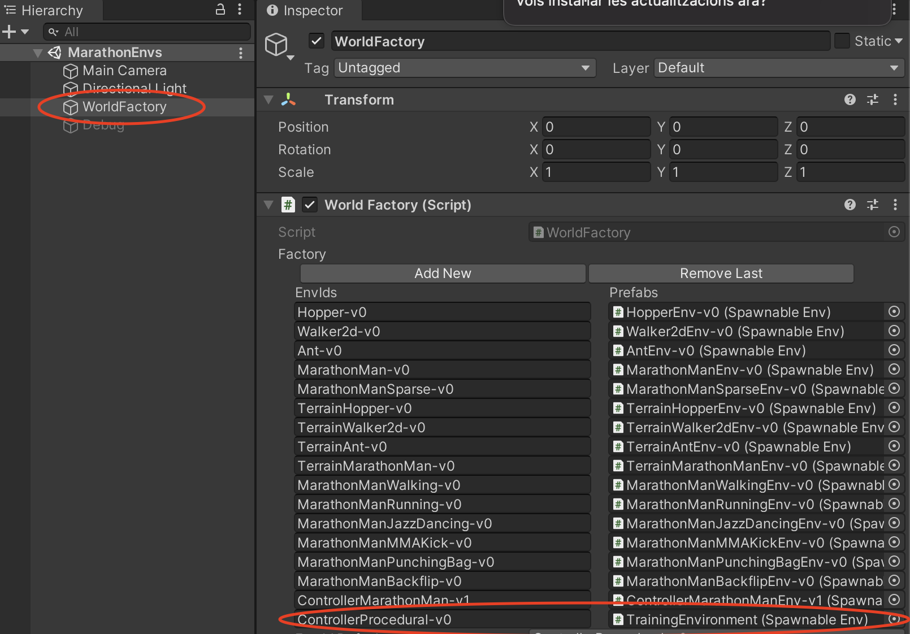
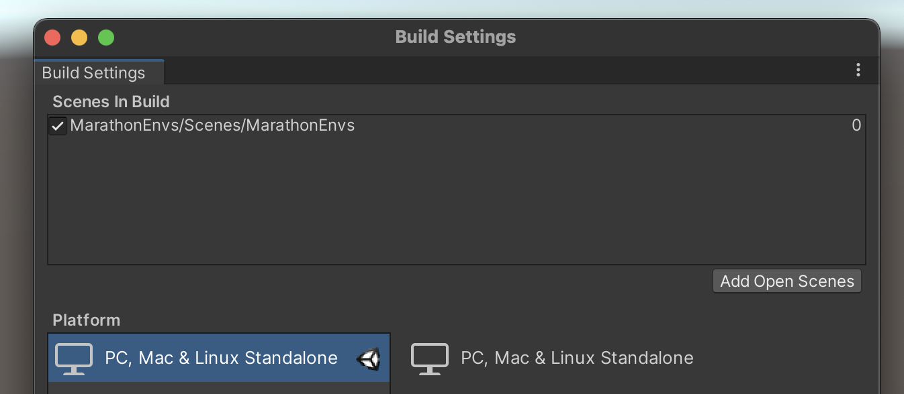

# Training with the Marathon Controller

Below we detail how to generate a training environment and launch the training.


### 1 How to generate a new training environment

To simplify the creation of a training environment, you can do it directly from a character with an animation controller associated to it.

To do so:

1. Open the scene found in `Assets > ProceduralGeneration > 2.GenerateTrainingEnvFromAnimatedCharacter.unity`

2. Add the animated character that you prefer

   It needs to be a character that moves, either interactively, either as a long sequence. For results to work reasonably, there needs to be some variety of movements, otherwise the range of motion will be too narrow, and the trianing will give poor results.

3. Select the gameObject *CHECKME-generate-training-env*. That gameObject has  the component *Training Environment Generator*. You should drag in the first 3 fields  the character that you want to use, as well as it's head, and it's root. Below you can find an example with a character consisting of a very long animation:


4. At the bottom of the *Training Environment Generator* you can find the 3 steps that you need to go through:


Once you have gone through these 3 steps, you will have an environment generated. It will be in *Assets > MarathonEnvs > Environments* and, if it the first one, will be called *TrainingEnvironment*.


If one already exists, it will store it with a name like *TrainingEnvironment 1*, and add indices (2,3,...).

5. Open the scene *Assets > MarathonEnvs > Scenes > MarathonEnvs*. When you select the gameObject *WorldFactory*, you will see a list of environments. Click on Add New, give it a name (in the example below I called it *ControllerProcedural-v0*), and add the Procedural Environment that was stored. If you do so, it should look like below



6. You can now train using the usual procedure, like below:

In **editor** (useful to check everything goes well):

```
mlagents-learn config/marathon_envs_config.yaml --run-id=Procedural-v1 --env-args --spawn-env=ControllerProcedural-v0
```

With a **binary** file:

- Compile the project only with the scene MarathonEnvs



Once compiled, simply launch the *marathonenvs* training environment, and launch the training as explained above, making sure that the `--spawn-env`variable is targeting the name that you associated with your procedural environment.

### 2 How to train an existing environment

You can either make a binary containing only the *MarathonEnvs.unity* scene and run the instructions below, or do a quick training test in editor.

macOS format:

```
mlagents-learn config/marathon_envs_config.yaml --env="envs/MarathonEnvs" --num-envs=10 --run-id=Hopper-001 --no-graphics --env-args --spawn-env=Hopper-v0 --num-spawn-envs=50
```

Windows format:

```
mlagents-learn config\marathon_envs_config.yaml --env="envs\MarathonEnvs\Marathon Environments.exe" --num-envs=25 --run-id=newMlAgents-007 --no-graphics --env-args --spawn-env=ControllerMarathonMan-v1 --num-spawn-envs=35
```

Example to test quickly in editor:

```
mlagents-learn config\marathon_envs_config.yaml --run-id=test-2020-01-06-v2 --env-args --spawn-env=ControllerMarathonMan-v1 
```

